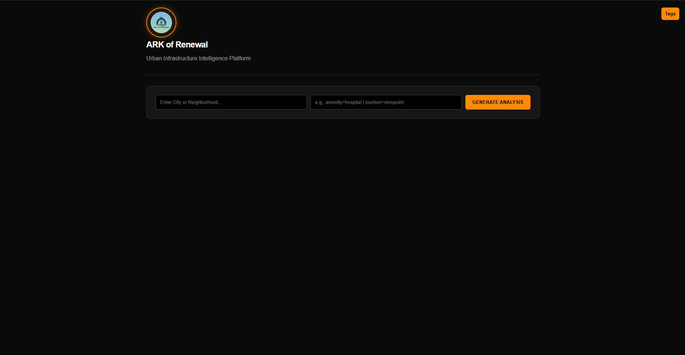

<div align="center">

# 🌆 Urban Infrastructure Intelligence Platform

**An AI-powered web application that analyzes urban infrastructure using real-time geospatial data and visualizes insights through interactive maps and charts.**

<br/>


<br/>

   [](https://urban-infrastructure-intelligence.onrender.com/)

<br/>



</div>

---

## 🚀 Features

* 📍 Location-based infrastructure analysis
* 🏥 Fetch real-time data from OpenStreetMap (Overpass API)
* 📊 Interactive charts using Plotly
* 🗺 Map visualization using Leaflet
* 🔥 Heatmap for infrastructure density
* 📏 Distance calculation using Geopy
* 🧠 AI-ready architecture for future upgrades

---

## 🌟 Vision

To build an AI-based urban intelligence platform that analyzes infrastructure, identifies gaps, and predicts optimal development locations—enabling smarter, data-driven decisions for sustainable cities.

---

## 🛠 Tech Stack

* **Backend:** Python, Flask
* **Frontend:** HTML, CSS, JavaScript
* **APIs:** OpenStreetMap (Overpass API)
* **Libraries:** Pandas, Geopy, Requests
* **Visualization:** Plotly, Leaflet.js, Heatmap

---

## 📂 Project Structure

```
├── img/ark.png
├── static
├── templates/index.html
├── LICENSE
├── Procfile
├── app.py
├── README.md
├── requirements.txt
```

---

## ⚙️ How to Run

1. Clone the repository
```
git clone https://github.com/vivekanandaasuru28-code/Urban-Infrastructure-Intelligence-Platform.git
```
2. Install dependencies
```
pip install flask pandas requests geopy plotly
```
3. Run the app
```
python app.py
```
4. Open in browser
```
http://127.0.0.1:5000
```

---

## 📊 How It Works

1. Enter a location and infrastructure types
2. App converts location to coordinates
3. Fetches nearby data from OpenStreetMap
4. Calculates distances and processes data
5. Displays:
   * 📍 Map markers
   * 🔥 Heatmap
   * 📊 Charts

---

## 🎯 Use Cases

* Urban Planning
* Infrastructure Gap Analysis
* Smart City Projects
* Data Science Learning

---

## 🔮 Future Improvements

* 🤖 AI scoring system
* 🧠 Machine learning clustering
* 📍 Business location recommendation
* 🌐 Integration with satellite datasets

---

## 👨‍💻 Author

**Vivek**
BSc Data Science Student

---

## ⭐ Support

If you like this project, give it a ⭐ on GitHub!

[](https://github.com/vivekanandaasuru28-code/Urban-Infrastructure-Intelligence-Platform)
